## With TypeScript 2.8+ ：更好的 React 组件开发模式

近两年来一直在关注 React 开发，最近也开始全面应用 TypeScript 。国内有很多讲解 React 和 TypeScript 的教程，但如何将 TypeScript 更好地应用到 React 组件开发模式的文章却几乎没有（也可能是我没找到），特别是 TS 的一些新特性，如：条件类型、条件类型中的类型引用等。这些新特性如何应用到 React 组件开发？没办法只能去翻一些国外的文章，结合 TS 的官方文档慢慢摸索... 于是就有了想法把这个过程整理成文档。

本文内容很长，希望你有个舒服的椅子，我们马上开始。

> 所有代码均使用 React 16.3、TypeScript 2.9 + strict mode 编写


## 开始

本文假设你已经对 React、TypeScript 有一定的了解。我不会讲到例如：webpack 打包、Babel 转码、TypeScript 编译选项这一类的问题，而将一切焦点放在如何将 TS 2.8+ 更好地应用到 React 组件设计模式中。

首先，我们从无状态组件开始。


## 无状态组件

无状态组件就是没有 `state` 的，通常我们也叫做纯函数组件。用原生 JS 我们可以这样写一个按钮组件：

```typescript
import React from 'react';

const Button = ({onClick: handleClick, children}) => (
  <button onClick={handleClick}>{children}</button>
);
```


如果你把代码直接放到 `.tsx` 文件中，`tsc` 编译器马上会提示错误：有隐含的 any 类型，因为用了严格模式。我们必须明确的定义组件属性，修改一下：

```typescript
import React, { MouseEvent, ReactNode } from 'react';

interface Props { 
 onClick(e: MouseEvent<HTMLElement>): void;
 children?: ReactNode;
};

const Button = ({ onClick: handleClick, children }: Props) => (
  <button onClick={handleClick}>{children}</button>
);
```


OK，错误没有了！好像已经完事了？其实再花点心思可以做的更好。

React 中有个预定义的类型，`SFC` ：

```typescript
type SFC<P = {}> = StatelessComponent<P>;
```

他是 `StatelessComponent` 的一个别名，而 `StatelessComponent` 声明了纯函数组件的一些预定义示例属性和静态属性，如：`children`、`defaultProps`、`displayName` 等，所以我们不需要自己写所有的东西！


最后我们的代码是这样的：

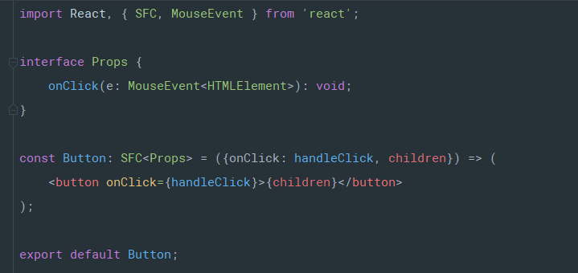


## 有状态的类组件

接着我们来创建一个计数器按钮组件。首先我们定义初始状态：

```typescript
const initialState = {count: 0};
```


然后，定义一个别名 `State` 并用 TS 推断出类型：

```typescript
type State = Readonly<typeof initialState>;
```

> 知识点：这样做不用分开维护接口声明和实现代码，比较实用的技巧


同时应该注意到，我们将所有的状态属性声明为  `readonly` 。然后我们需要明确定义 state 为组件的实例属性：

```typescript
readonly state: State = initialState;
```

为什么要这样做？我们知道在 React 中我们不能直接改变 `State` 的属性值或者 `State` 本身：

```typescript
this.state.count = 1; 
this.state = {count: 1};
```

如果这样做在运行时将会抛出错误，但在编写代码时却不会。所以我们需要明确的声明 `readonly` ，这样 TS 会让我们知道如果执行了这种操作就会出错了：

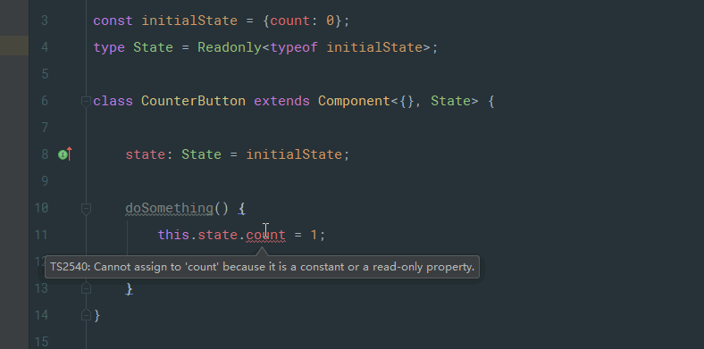


下面是完整的代码：

> 这个组件不需要外部传递任何 `Props` ，所以泛型的第一个参数给的是不带任何属性的对象

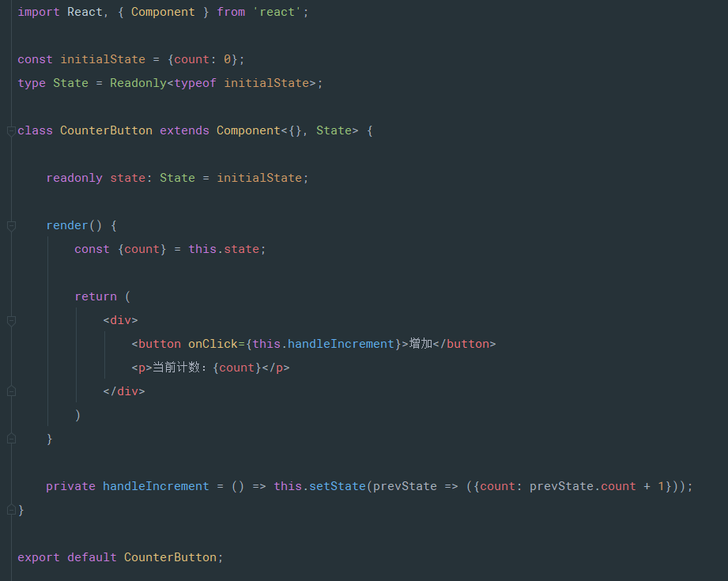


## 属性默认值

让我们来扩展一下纯函数按钮组件，加上一个颜色属性：

```typescript
interface Props {
    onClick(e: MouseEvent<HTMLElement>): void;
    color: string;
}
```

如果想要定义属性默认值的话，我们知道可以通过 `Button.defaultProps = {...}` 做到。并且我们需要把这个属性声明为可选属性：（注意属性名后的 `?` ）

```typescript
interface Props {
    onClick(e: MouseEvent<HTMLElement>): void;
    color?: string;
}
```


那么组件现在看起来是这样的：

```typescript
const Button: SFC<Props> = ({onClick: handleClick, color, children}) => (
    <button style={{color}} onClick={handleClick}>{children}</button>
);
```

一切看起来好像都很简单，但是这里有一个“痛点”。注意我们使用了 TS 的严格模式，`color?: string` 这个可选属性的类型现在是联合类型 -- `string | undefined` 。

这意味着什么？如果你要对这种属性进行一些操作，比如：`substr()` ，TS 编译器会直接报错，因为类型有可能是 `undefined` ，TS 并不知道属性默认值会由 `Component.defaultProps` 来创建。


碰到这种情况我们一般用两种方式来解决：

- 使用类型断言手动去除，添加 `!` 后缀，像这样：`color!.substr(...)` 。
- 使用条件判断或者三元操作符让 TS 编译器知道这个属性不是 undefined，比如： `if (color) ...` 。


以上的方式虽然可以工作但有种多此一举的感觉，毕竟默认值已经有了只是 TS 编译器“不知道”而已。下面来说一种可重用的方案：我们写一个 `withDefaultProps` 函数，利用 TS 2.8 的条件类型映射，可以很简单的完成：

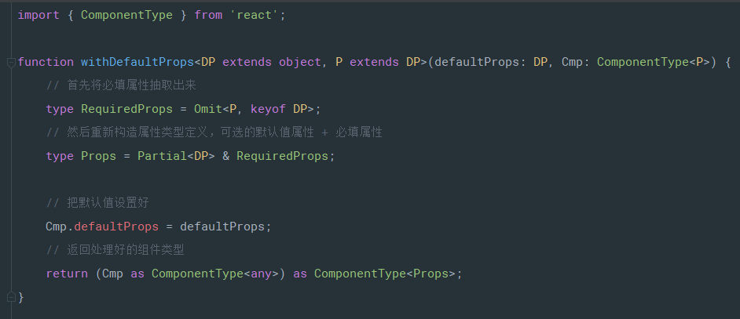

这里涉及到两个 type 定义，写在 `src/types/global.d.ts` 文件里面：

```typescript
declare type DiffPropertyNames<T extends string | number | symbol, U> =
    { [P in T]: P extends U ? never: P }[T];

declare type Omit<T, K> = Pick<T, DiffPropertyNames<keyof T, K>>;
```

看一下 [TS 2.8 的新特性说明](http://www.typescriptlang.org/docs/handbook/release-notes/typescript-2-8.html) 关于 `Conditional Types` 的说明，就知道这两个 `type` 的原理了。

> 注意 TS 2.9 的新变化：`keyof T` 的类型是 `string | number | symbol ` 的结构子类型。


现在我们可以利用 `withDefaultProps` 函数来写一个有属性默认值的组件了：

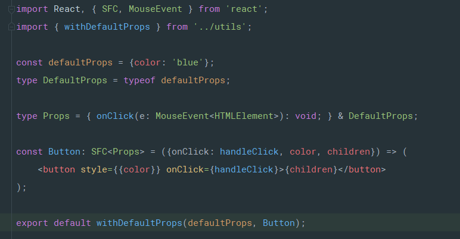

现在使用这个组件时默认值属性已经发生作用，是可选的；并且在组件内部使用这些默认值属性不用再手动断言了，这些默认值属性就是必填属性！感觉还不错对吧 :smile:

> `withDefautProps` 函数同样可以应用在 `stateful` 有状态的类组件上。


## 渲染回调模式

有一种重用组件逻辑的设计方式是：把组件的  `children` 写成渲染回调函数或者暴露一个 `render` 函数属性出来。我们将用这种思路来做一个折叠面板的场景应用。

首先我们先写一个 `Toggleable` 组件，完整的代码如下：


下面我们来逐段解释下这段代码，首先先看到组件的属性声明相关部分：

```typescript
type Props = Partial<{
    children: RenderCallback;
    render: RenderCallback;
}>;

type RenderCallback = (args: ToggleableRenderArgs) => React.ReactNode;

type ToggleableRenderArgs = {
    show: boolean;
    toggle: Toggleable['toggle'];
}
```

我们需要同时支持 `children` 或 `render` 函数属性，所以这两个要声明为可选的属性。注意这里用了 `Partial` 映射类型，这样就不需要每个手动 `?` 操作符来声明可选了。

为了保持 ***DRY*** 原则（Don't repeat yourself ），我们还声明了 `RenderCallback` 类型。

最后，我们将这个回调函数的参数声明为一个独立的类型：`ToggleableRenderArgs` 。

注意我们使用了 TS  的**查找类型**（*lookup types* ），这样 `toggle` 的类型将和类中定义的同名方法类型保持一致：

```typescript
private toggle = (event: MouseEvent<HTMLElement>) => {
    this.setState(prevState => ({show: !prevState.show}));
};
```

> 同样是为了 DRY ，TS 非常给力！


接下来是 State 相关的：

```typescript
const initialState = {show: false};
type State = Readonly<typeof initialState>;
```

这个没什么特别的，跟前面的例子一样。


剩下的部分就是 渲染回调 设计模式了，代码很好理解：

```typescript
class Toggleable extends Component<Props, State> {

    // ...

    render() {
        const {children, render} = this.props;
        const {show} = this.state;
        const renderArgs = {show, toggle: this.toggle};

        if (render) {
            return render(renderArgs);
        } else if (isFunction(children)) {
            return children(renderArgs);
        } else {
            return null;
        }
    }

    // ...
}
```


现在我们可以将 children 作为一个渲染函数传递给 Toggleable 组件：

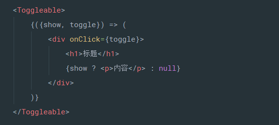

或者将渲染函数传递给 render 属性：

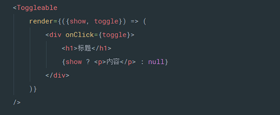


下面我们来完成折叠面板剩下的工作，先写一个 Panel 组件来重用 Toggleable 的逻辑：

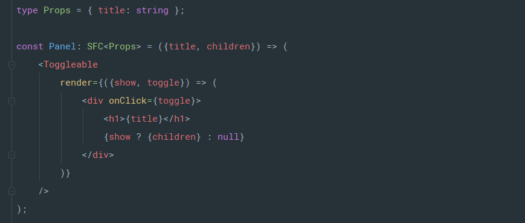

最后写一个 Collapse 组件来完成这个应用：

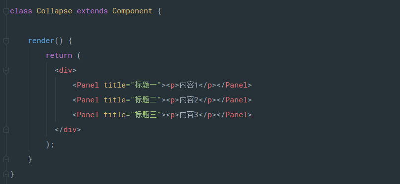


这里我们不谈样式的事情，运行起来看看，跟期待的效果是否一致？

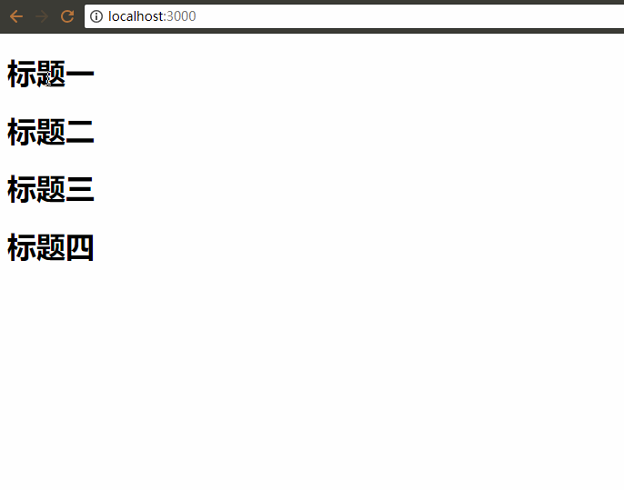

> 这种方式对于需要扩展渲染内容时非常有用：Toggleable 组件并不知道也不关心具体的渲染内容，但他控制着显示状态逻辑！


## 组件注入模式

为了使组件逻辑更具伸缩性，下面我们来说说组件注入模式。


那么什么是组件注入模式呢？如果你用过 `React-Router` ，你已经使用过这种模式来定义路由了：

```jsx
<Route path="/example" component={Example}/>
```


不同于渲染回调模式，我们使用 `component` 属性“注入”一个组件。为了演示这个模式是如何工作的，我们将重构折叠面板这个场景，首先写一个可重用的 PanelItem 组件：

```typescript
import { ToggleableComponentProps } from './Toggleable';

type PanelItemProps = { title: string };

const PanelItem: SFC<PanelItemProps & ToggleableComponentProps> = props => {
    const {title, children, show, toggle} = props;

    return (
        <div onClick={toggle}>
            <h1>{title}</h1>
            {show ? children : null}
        </div>
    );
};
```


然后重构 Toggleable 组件：加入新的 `component` 属性。对比先头的代码，我们需要做出如下变化：

- `children` 属性类型更改为 function 或者 ReactNode（当使用 `component` 属性时）
- `component` 属性将传递一个组件注入进去，这个注入组件的属性定义上需要有 `ToggleableComponentProps` （其实是原来的 `ToggleableRenderArgs` ，还记得吗？）
- 还需要定义一个 ` props` 属性，这个属性将用来传递注入组件需要的属性值。我们会设置 `props` 可以拥有任意的属性，因为我们并不知道注入组件会有哪些属性，当然这样我们会丢失 TS 的严格类型检查...

```typescript
const defaultInjectedProps = {props: {} as { [propName: string]: any }};
type DefaultInjectedProps = typeof defaultInjectedProps;
type Props = Partial<{
    children: RenderCallback | ReactNode;
    render: RenderCallback;
    component: ComponentType<ToggleableComponentProps<any>>
} & DefaultInjectedProps>;
```


下一步我们把原来的 `ToggleableRenderArgs`  修改为 `ToggleableComponentProps` ，允许将注入组件需要的属性通过 `<Toggleable props={...}/> ` 这样来传递：

```typescript
type ToggleableComponentProps<P extends object = object> = {
    show: boolean;
    toggle: Toggleable['toggle'];
} & P;
```


现在我们还需要重构一下 `render` 方法：

```typescript
render() {
    const {component: InjectedComponent, children, render, props} = this.props;
    const {show} = this.state;
    const renderProps = {show, toggle: this.toggle};

    if (InjectedComponent) {
        return (
            <InjectedComponent {...props} {...renderProps}>
                {children}
            </InjectedComponent>
        );
    }

    if (render) {
        return render(renderProps);
    } else if (isFunction(children)) {
        return children(renderProps);
    } else {
        return null;
    }
}
```


我们已经完成了整个 Toggleable 组件的修改，下面是完整的代码：

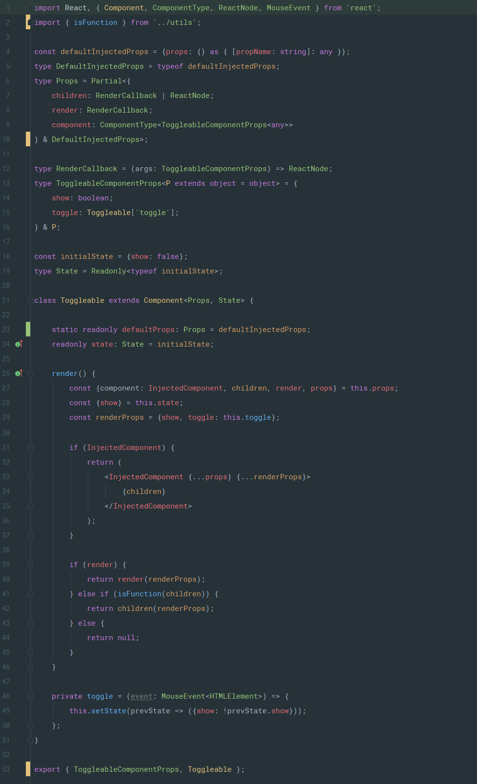


最后我们写一个 `PanelViaInjection` 组件来应用组件注入模式：

```typescript
import React, { SFC } from 'react';
import { Toggleable } from './Toggleable';
import { PanelItemProps, PanelItem } from './PanelItem';

const PanelViaInjection: SFC<PanelItemProps> = ({title, children}) => (
    <Toggleable component={PanelItem} props={{title}}>
        {children}
    </Toggleable>
);
```

> 注意：`props` 属性没有类型安全检查，因为他被定义为了包含任意属性的可索引类型：
> `{ [propName: string]: any }`


现在我们可以利用这种方式来重现折叠面板场景了：

```typescript
class Collapse extends Component {

    render() {
        return (
            <div>
                <PanelViaInjection title="标题一"><p>内容1</p></PanelViaInjection>
                <PanelViaInjection title="标题二"><p>内容2</p></PanelViaInjection>
                <PanelViaInjection title="标题三"><p>内容3</p></PanelViaInjection>
            </div>
        );
    }
}
```


## 泛型组件

在组件注入模式的例子中，`props` 属性丢失了类型安全检查，我们如何去修复这个问题呢？估计你已经猜出来了，我们可以把 Toggleable 组件重构为泛型组件！


下来我们开始重构 Toggleable 组件。首先我们需要让 `props` 支持泛型：

```typescript
type DefaultInjectedProps<P extends object = object> = { props: P };
const defaultInjectedProps: DefaultInjectedProps = {props: {}};
                          
type Props<P extends object = object> = Partial<{
    children: RenderCallback | ReactNode;
    render: RenderCallback;
    component: ComponentType<ToggleableComponentProps<P>>
} & DefaultInjectedProps<P>>;
```


然后让 Toggleable 的 class 也支持泛型：

```typescript
class Toggleable<T extends object = object> extends Component<Props<T>, State> {}
```

看起来好像已经搞定了！如果你是用的 TS 2.9，可以直接这样用：

```typescript
const PanelViaInjection: SFC<PanelItemProps> = ({title, children}) => (
     <Toggleable<PanelItemProps> component={PanelItem} props={{title}}>
         {children}
     </Toggleable>
);
```


但是如果 <= TS 2.8 ...  JSX 里面不能直接应用泛型参数  :worried:  那么我们还有一步工作要做，加入一个静态方法 `ofType` ，用来进行构造函数的类型转换：

```typescript
static ofType<T extends object>() {
    return Toggleable as Constructor<Toggleable<T>>;
}
```

这里用到一个 type：`Constructor`，依然定义在 `src/types/global.d.ts` 里面：

```typescript
declare type Constructor<T = {}> = { new(...args: any[]): T };
```


好了，我们完成了所有的工作，下面是 Toggleable 重构后的完整代码：


现在我们来看看怎么使用这个泛型组件，重构下原来的 PanelViaInjection 组件：

```typescript
import React, { SFC } from 'react';
import { Toggleable } from './Toggleable';
import { PanelItemProps, PanelItem } from './PanelItem';

const ToggleableOfPanelItem = Toggleable.ofType<PanelItemProps>();

const PanelViaInjection: SFC<PanelItemProps> = ({title, children}) => (
    <ToggleableOfPanelItem component={PanelItem} props={{title}}>
        {children}
    </ToggleableOfPanelItem>
);
```

所有的功能都能像原来的代码一样工作，并且现在 `props` 属性也支持 TS 类型检查了，很棒有木有！ :smiley:

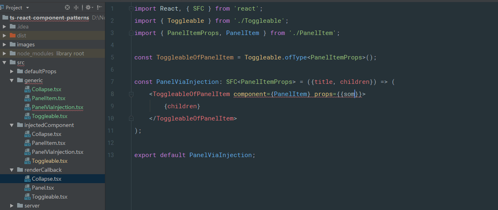


## 高阶组件

最后我们来看下 HOC 。前面我们已经实现了 Toggleable 的渲染回调模式，那么很自然的我们可以衍生出一个 HOC 组件。

> 如果对 HOC 不熟悉的话，可以先看下 React 官方文档对于 [HOC](https://reactjs.org/docs/higher-order-components.html) 的说明。


先来看看定义 HOC 我们需要做哪些工作：

- `displayName` （方便在 devtools 里面进行调试）
- `WrappedComponent ` （可以访问原始的组件 -- 有利于调试）
- 引入 [hoist-non-react-statics](https://github.com/mridgway/hoist-non-react-statics) 包，将原始组件的静态方法全部“复制”到 HOC 组件上


下面直接上代码 -- `withToggleable` 高阶组件：

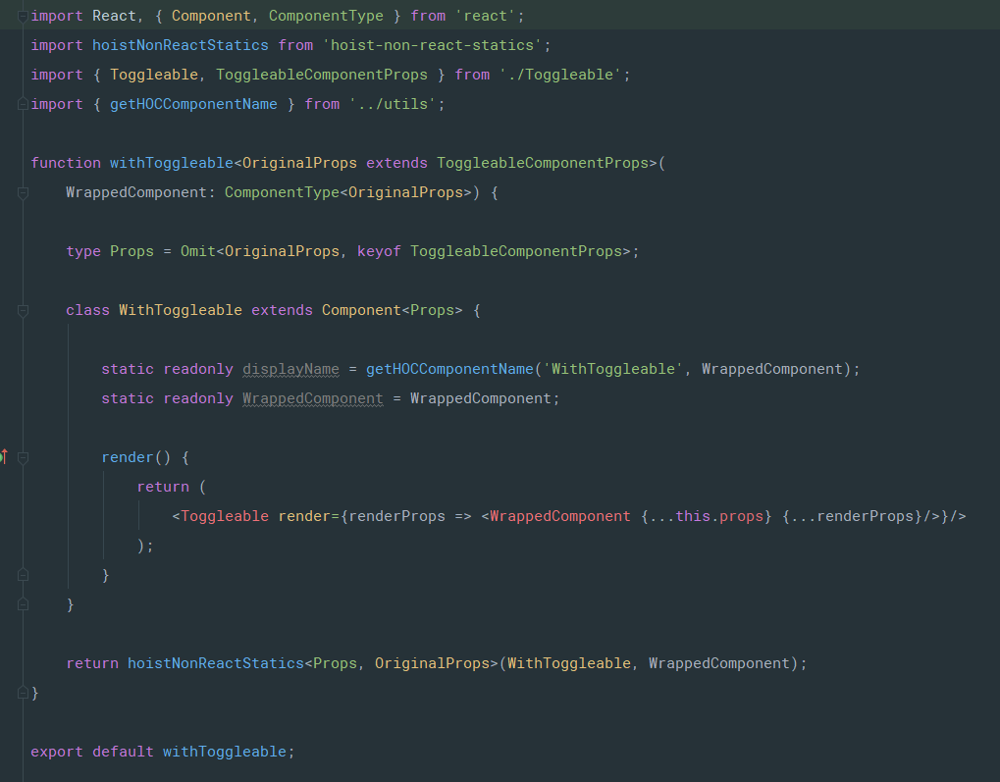


现在我们来用 HOC 重写一个 Panel ：

```typescript
import { PanelItem } from './PanelItem';
import withToggleable from './withToggleable';

const PanelViaHOC = withToggleable(PanelItem);
```


然后，又可以实现折叠面板了 :smile: 

```typescript
class Collapse extends Component {

    render() {
        return (
            <div>
                <PanelViaHOC title="标题一"><p>内容1</p></PanelViaHOC>
                <PanelViaHOC title="标题二"><p>内容2</p></PanelViaHOC>
            </div>
        );
    }
}
```


## 尾声

感谢能坚持看完的朋友，你们真的很棒！

如果觉得还不错请帮忙给个 :star:


最后，感谢 Anders Hejlsberg 和所有的 TS 贡献者 :thumbsup:

