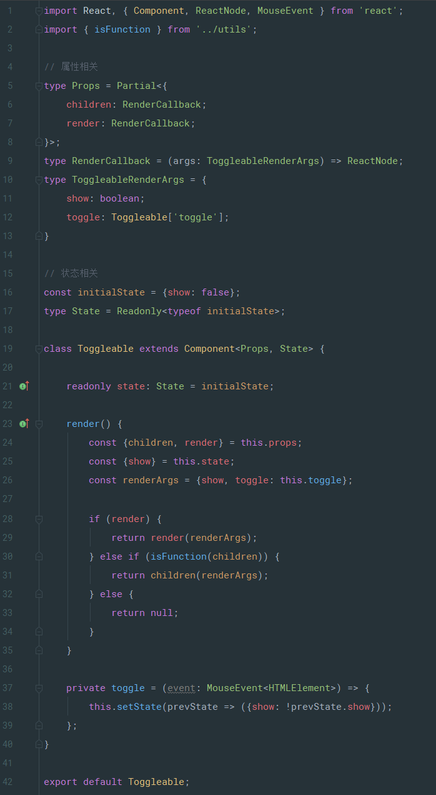

## With TypeScript 2.8：更好的 React 组件开发模式

近两年来一直在搞 React 应用开发，TypeScript 是不久前才学上的。国内有很多讲解 React 和 TypeScript 的教程，但如何将 TypeScript 更好地应用到 React 组件开发模式的文章却几乎没有，特别是 TS 2.8的一些新特性，如：条件类型、条件类型中的类型引用、重载访问修饰符等。这些新特性如何应用于 React 组件开发？没办法只能去翻一些国外的文章，结合 TS 的官方文档慢慢摸索... 于是就有了想法把这个过程整理成文档，希望能让读到的朋友少踩点坑。无奈水平有限，难免出现错漏，欢迎大家拍砖，共同进步。

本文内容很长，希望你有个舒服的椅子，我们马上开始。

> 所有示例代码都放在 [Github仓库](https://github.com/deepfunc/ts-react-component-patterns)
>
> 所有示例代码均使用 React 16.3.2、TypeScript 2.8 + strict mode 编写


## 开始

本文假设你已经对 React、TypeScript 有一定的了解。我不会讲到例如：webpack 打包、Babel 转码、TypeScript 编译选项这一类的问题，而将一切焦点放在如何将 TS 2.8 更好地应用到 React 组件设计模式中。首先，我们来谈谈无状态组件。


## 无状态组件

无状态组件就是没有 `state` 的，通常我们也叫做纯函数组件。用原生 JS 我们可以这样写一个按钮组件：

```typescript
import React from 'react';

const Button = ({onClick: handleClick, children}) => (
  <button onClick={handleClick}>{children}</button>
);
```


如果你把代码直接放到 `.tsx` 文件中，`tsc` 编译器马上会提示错误：有隐含的 any 类型，因为用了严格模式。我们必须明确的定义组件属性，修改一下：

```typescript
import React, { MouseEvent, ReactNode } from 'react';

interface Props { 
 onClick(e: MouseEvent<HTMLElement>): void;
 children?: ReactNode;
};

const Button = ({ onClick: handleClick, children }: Props) => (
  <button onClick={handleClick}>{children}</button>
);
```


OK，错误没有了！好像已经完事了？其实再花点心思可以做的更好。

React 中有个预定义的类型，`SFC`：

```typescript
type SFC<P = {}> = StatelessComponent<P>;
```

他是 `StatelessComponent` 的一个别名，而 `StatelessComponent` 声明了纯函数组件的一些预定义示例属性和静态属性，如：`children`、`defaultProps`、`displayName` 等，所以我们不需要自己写所有的东西！


最后我们的代码是这样的：


## 有状态的类组件

接着我们来创建一个计数器按钮组件。首先我们定义初始状态：

```typescript
const initialState = {count: 0};
```


然后，定义一个别名 `State` 并用 TS 推断出类型：

```typescript
type State = Readonly<typeof initialState>;
```

> 知识点：这样做不用分开维护接口声明和实现代码，比较实用的技巧


同时应该注意到，我们将所有的状态属性声明为  `readonly` 。然后我们需要明确定义 state 为组件的实例属性：

```typescript
readonly state: State = initialState;
```

为什么要这样做？我们知道在 React 中我们不能直接改变 `State` 的属性值或者 `State` 本身：

```typescript
this.state.count = 1; 
this.state = {count: 1};
```

如果这样做在运行时将会抛出错误，但在编写代码时却不会。所以我们需要明确的声明 `readonly` ，这样 TS 会让我们知道如果执行了这种操作就会出错了：


下面是完整的代码：

> 这个组件不需要外部传递任何 `Props` ，所以泛型的第一个参数给的是不带任何属性的对象


## 属性默认值

让我们来扩展一下纯函数按钮组件，加上一个颜色属性：

```typescript
interface Props {
    onClick(e: MouseEvent<HTMLElement>): void;
    color: string;
}
```

如果想要定义属性默认值的话，我们知道可以通过 `Button.defaultProps = {...}` 做到。并且我们需要把这个属性声明为可选属性：（注意属性名后的 `?` ）

```typescript
interface Props {
    onClick(e: MouseEvent<HTMLElement>): void;
    color?: string;
}
```


那么组件现在看起来是这样的：

```typescript
const Button: SFC<Props> = ({onClick: handleClick, color, children}) => (
    <button style={{color}} onClick={handleClick}>{children}</button>
);
```

一切看起来好像都很简单，但是这里有一个“痛点”。注意我们使用了 TS 的严格模式，`color?: string` 这个可选属性的类型现在是联合类型 -- `string | undefined` 。

这意味着什么？如果你要对这种属性进行一些操作，比如：`substr()` ，TS 编译器会直接报错，因为类型有可能是 `undefined` ，TS 并不知道属性默认值会由 `Component.defaultProps` 来创建。


碰到这种情况我们一般用两种方式来解决：

- 使用类型断言手动去除，添加 `!` 后缀，像这样：`color!.substr(...)` 。
- 使用条件判断或者三元操作符让 TS 编译器知道这个属性不是 undefined，比如： `if (color) ...` 。


以上的方式虽然可以工作但有种多此一举的感觉，毕竟默认值已经有了只是 TS 编译器“不知道”而已。下面来说一种可重用的方案：我们写一个 `withDefaultProps` 函数，利用 TS 2.8 的条件类型映射，可以很简单的完成：


这里涉及到两个 `type` 定义：

```typescript
declare type DiffPropertyNames<T extends string, U extends string> = { [P in T]: P extends U ? never: P }[T];

declare type Omit<T, K extends keyof T> = Pick<T, DiffPropertyNames<keyof T, K>>;
```

看一下 [TS 2.8 的新特性说明](http://www.typescriptlang.org/docs/handbook/release-notes/typescript-2-8.html) 关于 `Conditional Types` 的说明，就知道这两个 `type` 的原理了。


现在我们可以利用 `withDefaultProps` 函数来写一个有属性默认值的组件了：


现在使用这个组件时默认值属性已经发生作用，是可选的；并且在组件内部使用这些默认值属性不用再手动断言了，这些默认值属性就是必填属性！感觉还不错对吧 ：）

> `withDefautProps` 函数同样可以应用在 `stateful` 有状态的类组件上。


## 渲染回调 设计模式

有一种重用组件逻辑的设计方式是：把组件的  `children` 变成一个渲染回调函数或者暴露一个 `render` 函数属性出来。我们将用这种思路来做一个折叠面板的场景应用。

首先我们先写一个 `Toggleable` 组件，完整的代码如下：




下面我们来逐段解释下这段代码，首先先看到组件的属性声明相关部分：

```typescript
type Props = Partial<{
    children: RenderCallback;
    render: RenderCallback;
}>;

type RenderCallback = (args: ToggleableRenderArgs) => React.ReactNode;

type ToggleableRenderArgs = {
    show: boolean;
    toggle: Toggleable['toggle'];
}
```

我们需要同时支持 `children` 或 `render` 函数属性，所以这两个要声明为可选的属性。注意这里用了 `Partial` 映射类型，这样就不需要每个手动 `?` 操作符来声明可选了。

为了保持 ***DRY*** 原则（Don't repeat yourself ），我们还声明了 `RenderCallback` 类型。

最后，我们将这个回调函数的参数声明为一个独立的类型：`ToggleableRenderArgs` 。

注意我们使用了 TS  的**查找类型**（*lookup types* ），这样 `toggle` 的类型将和类中定义的同名方法类型保持一致：

```typescript
private toggle = (event: MouseEvent<HTMLElement>) => {
    this.setState(prevState => ({show: !prevState.show}));
};
```

> 同样是为了 DRY ，TS 非常给力！


接下来是 State 相关的：

```typescript
const initialState = {show: false};
type State = Readonly<typeof initialState>;
```

这个没什么特别的，跟前面的例子一样。


剩下的部分就是 渲染回调 设计模式了，代码很好理解：

```typescript
class Toggleable extends Component<Props, State> {

    // ...

    render() {
        const {children, render} = this.props;
        const {show} = this.state;
        const renderArgs = {show, toggle: this.toggle};

        if (render) {
            return render(renderArgs);
        } else if (isFunction(children)) {
            return children(renderArgs);
        } else {
            return null;
        }
    }

    // ...
}
```


现在我们可以将 children 作为一个渲染函数传递给 Toggleable 组件：


或者将渲染函数传递给 render 属性：


下面我们来完成折叠面板剩下的工作，先写一个 Panel 组件来重用 Toggleable 的逻辑：


最后写一个 Collapse 组件来完成这个应用：


运行起来，跟我们期待的效果一致：）


> 这种方式对于需要扩展渲染内容时非常有用：Toggleable 组件并不知道也不关心具体的渲染内容，但他控制着显示状态逻辑！


## 组件注入模式

